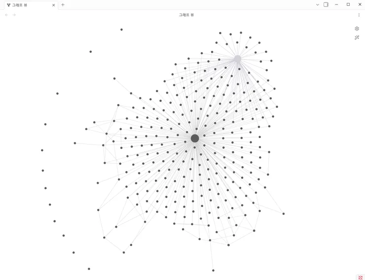

## 1. 하이라이트/요약

이 글은 클리앙 "팁과강좌" 게시판에 올라온 실험 보고로, 안드레 카파시(Andrej Karpathy)가 제안한 "LLM 위키(LLM Wiki)" 개념이 개인 지식베이스(knowledge base) 용도로 실제로 쓸 만한지 저자가 직접 검증한 내용이다. LLM 위키란 파편화된 문서·메모·일정을 LLM이 분류하고 상호 연관관계를 파악해 구조화된 마크다운 파일, 즉 위키 형태로 저장해 두는 방식이다. 저자는 이것이 완전히 새로운 개념은 아니지만, LLM 성능 향상과 스킬(skill)·하네스(harness) 같은 도구 환경이 갖춰진 지금 시점에서 직관적이고 보편적인 기술에 기반한 시의적절한 제안이라고 평가한다.

실험은 세 가지 질문을 축으로 설계되었다. (1) LLM 위키가 RAG(Retrieval-Augmented Generation)보다 성능이 나은가, (2) 저자의 요구사항(메모 관리, 클로드 코드 프로젝트, 업무 문서/일정/task 관리)에 적합한 기술인가, (3) 어떤 형태로 구현해야 편리하고 효율적인 지식베이스 관리툴이 되는가. 저자는 카파시의 초안 지침을 스킬 형태로 재구현해 Gemini CLI에서 실행하고, 대조군으로는 NotebookLM(RAG 기반)에 동일한 데이터를 업로드했다. 데이터는 Google Keep에서 백업한 500개 이상의 독립적인 JSON 메모다.

결론적으로 두 방식 모두 500+ 메모를 처리하는 데 부족함이 없었고 답변도 대체로 유사했으나, 의미 기반 검색 + 추론 테스트에서는 LLM 위키가 더 나은 답을 냈다. 저자는 LLM 위키가 개인 규모 지식베이스로 충분하며, RAG를 에이전트에 붙이기 위한 구현/설정/튜닝보다 간단하고 효율적이라고 판단했다. 다만 500+ 메모 등록에 20분 이상 걸리고 검색도 느려 즉각적인 응답이 필요한 메모 앱 대체는 어렵다는 점을 명확한 단점으로 지적한다.

## 2. 상세 요약

### 개요: LLM 위키란 무엇이고 왜 지금 주목받는가

저자는 LLM 위키를 처음 접했을 때 어려운 개념은 아니라고 봤다. 핵심은 "파편화된 문서, 메모, 일정 등을 LLM으로 분류하고 상호 연관관계를 파악해 위키 형태(구조적 md 파일)로 저장"하는 것이다. 실제로 위키에 파일을 등록하면 결과가 md 파일로 생성되고, 그 위키 폴더를 옵시디언(Obsidian)에서 열어 그래프 뷰(graph view)로 노드 간 연결을 시각적으로 볼 수 있다.

저자는 이 개념이 완전히 새롭지는 않다고 덧붙인다. 이전에 커뮤니티에 RAG 관련 글을 올렸을 때 "향상된 LLM 성능 자체를 활용하는 것이 더 효과적"이라는 조언이 댓글로 달렸을 정도였다. 그럼에도 지금 주목할 만한 이유는, LLM 성능이 크게 향상되었고 이를 입맛대로 활용할 수 있는 도구 환경(스킬, 하네스 등)이 갖춰진 상태에서 카파시의 제안이 직관적이고 보편적인 기술에 기초하기 때문이라고 본다. 물론 카파시의 후광효과도 일부 작용한다고 인정한다.

저자의 동기는 실용적이다. 메모 관리, 개인적으로 만드는 클로드 코드(Claude Code) 프로젝트, 업무용 문서/일정/task 관리에 LLM을 쓰려고 테스트를 이어오고 있었고, 기존에는 전통적인 의미 기반 검색인 RAG를 만져봤지만 AI 에이전트에 붙이기에는 기술적으로 복잡하고 튜닝할 것이 많았다. "LLM 위키를 쓰면 RAG보다 간편하게 요구사항을 만족할 수 있을까"가 실험의 출발점이다.

### 준비 과정

카파시의 LLM 위키 초안은 `llm-wiki`라는 지침(instruction) 파일 형태로 gist에 공개되어 있다(https://gist.github.com/karpathy/442a6bf555914893e9891c11519de94f). 이것만으로도 동작하지만, 대부분은 자기 요구사항에 맞게 수정해서 쓰는 것으로 보인다. 저자는 여러 클로드 코드 프로젝트에 쉽게 적용할 수 있도록 이를 스킬 형태로 만들었고, 카파시 초안을 바탕으로 테스트하면서 원하는 기능을 추가하고 기본적인 오류를 수정했다. 구현체는 https://github.com/godstale/llm-wiki 에 공개되어 있으며, 테스트는 Gemini CLI에서 진행했다.

RAG 대조군은 직접 만들지 않았다. 개인이 만든 RAG로는 성능·안정성을 담보할 수 없다는 판단에서, NotebookLM에 동일한 파일을 업로드하고 같은 질문을 던져 답변을 비교하는 방식을 택했다. 원본(raw) 데이터는 Google Keep에서 백업한 500개 이상의 JSON 텍스트 파일이다. 각 메모는 상호 연관관계를 고려하지 않고 작성된 독립 메모이며, 크기도 한두 줄짜리부터 책 한 챕터 분량까지 다양하다. 원문에는 코드 예제가 포함되어 있지 않다.

### 테스트 설계

500+ 메모에 대한 검색, 추론, 답변의 적절성을 세 단계로 나누어 테스트했다.

1. **기본 검색**: 파일 하나에 들어 있는 내용을 묻는 단순 질문은 어느 쪽이든 잘 처리하므로 비교가 무의미하다고 판단해 제외했다.
2. **의미 기반 검색 + 추론**: 매우 단순한 단어와 거기서 파생되는 맥락을 감안해 검색할 수 있는지 확인한다. 여러 시도에서 대부분 잘 수행했기 때문에 의도적으로 어려운 문제를 골랐다. 예를 들어 메모 중 "조선 삼대 명주", "화이트 와인"을 다룬 메모가 있는 상태에서 "주변에 추천할만한 술을 찾아줘"라고 질문해 "술"이라는 의미를 기반으로 검색하고, 그 결과로 답변을 생성하는지 본다. 단순 키워드 검색으로는 결과가 너무 많아 확인이 힘든 유형의 질문이다.
3. **다중 파일 통합 + 추론**: 3~4개 파일에 나누어 담긴 내용을 모두 확인하고 추론해 답변을 생성해야 하는 질문이다. 테스트용으로 미리 작성한 텍스트 파일을 500+ 메모 사이에 섞어 넣었다(https://github.com/godstale/LLM-WiKi/tree/main/test). 질문지는 다음과 같다.
   - 베트남 여행 잔여 예산 계산: 4개 파일의 숫자를 모두 읽고 산술 추론해야 정답 도출 가능
   - AI 개인 프로젝트 기술 격차 분석: 4개 파일의 내용을 종합해서 추론
   - 트레킹 장비 부족 분석: 3개 파일의 세부 내용을 모두 확인 후 재구성
   - 이번 주 집중 작업 스케줄 최적화: 4개 파일의 내용을 종합해서 추론
   - 회의 일정 조정(캘린더 + 회의실 + 연락처 고려): 4개 파일의 내용을 종합해서 추론

이 설계는 사실상 "needle in a haystack" 검색이 아니라, 검색된 조각을 얼마나 잘 종합(synthesis)하는가를 재는 데 초점이 있다.

### 테스트 결과 종합

LLM 위키와 RAG(NotebookLM) 모두 500개가 넘는 메모를 처리하는 데 별 부족함이 없었고 대부분 답변도 유사하게 나왔다. 전체 결과는 길어서 https://github.com/godstale/LLM-WiKi/blob/main/test/Test_Result.md 에 정리되어 있다.

2번 테스트("주변에 추천할만한 술을 찾아줘")에서 차이가 드러났다. LLM 위키는 "조선 삼대 명주", "리즐링 와인", 그리고 "위키의 맛집 및 모임 기록"에서 발췌해 답했고, 특히 술과 직접 관련이 없는 맛집 메모에서 특정 상황에 맞는 술(맥주)을 추천했다. 반면 NotebookLM은 "리즐링 화이트와인이 짧게 기록... 구체적으로 추천할 만한 술에 대한 정보가 없습니다"라고 답했다. 위키 생성 단계에서 LLM이 메모 간 연관관계를 미리 정리해 두었기 때문에 맥락 확장이 가능했던 것으로 보인다(불확실 - 저자가 원인을 명시하지는 않음).

3번 테스트는 3~4개 파일 기반 추론이 필요한 문제였는데, 답변 자체는 달랐지만 두 방식 모두 핵심 내용을 포함해 유사한 성능으로 평가되었다. 세부 내용에서는 LLM 위키가 조금 나은 듯하지만 저자 스스로 주관적 견해이며 큰 차이는 아니라고 선을 그었다.

### 그래서, LLM 위키가 쓸만하더냐?

저자의 평가는 다음과 같이 정리된다.

- 개인 규모의 지식베이스를 구축할 때 충분한 성능. 메모·자료 정리, AI 에이전트 프로젝트에서 산출물/메모리 관리 등에 적합해 보임.
- RAG를 에이전트에 붙이기 위해 구현/설정/튜닝하는 것보다 LLM 위키를 쓰는 것이 간단하고 효율적.
- NotebookLM(RAG)과 단순 비교해도 뒤떨어지지 않는 성능. 다만 NotebookLM이 쓸모없다는 뜻이 아니라 상호 보완 관계로 쓰면 좋다. 예: 유튜브 영상 요약처럼 NotebookLM으로 전처리한 데이터를 LLM 위키에 저장하는 파이프라인.
- LLM 위키는 내 입맛에 맞게 수정하기 좋고, 이미 생성된 위키를 정리/확장하는 것도 손쉽다. "그냥 LLM에게 시키면 된다."
- 그러나 느리다. 500+ 메모를 위키에 등록하는 데 20분 넘게 걸렸고, 위키 검색에도 시간이 꽤 걸린다. 일반 메모 앱처럼 사용자가 원할 때 즉각적인 응답을 주기는 어렵다.

### 이런 점은 감안해야 한다

- 처음 데이터를 처리(ingestion)할 때 NotebookLM 대비 시간이 꽤 걸린다.
- 이 테스트는 Gmail/캘린더/TODO/메모 같은 개인 데이터로만 진행했다. 복잡한 수식이나 이미지가 담긴 전문 리포트·산출물 처리는 검증하지 못했으며, 저자는 이런 자료는 RAG도 해결하기 쉽지 않은 문제라고 본다.
- 업무용으로 활용하려면 검색 맥락이 복잡하고 데이터가 방대하므로 [팀 구조/업무 프로세스/프로젝트 관리 …] 같은 정보와 결합해야 할 것이며, 따라서 온톨로지(ontology)나 기타 기법이 적용되어야 효율성을 판단할 수 있을 것이라고 전망한다. 이 부분은 저자가 개인적으로 관심 있는 주제로 추후 테스트할 예정이다.

### 저자의 향후 계획

저자는 개인적으로 LLM 위키가 굉장히 만족스러웠다고 밝힌다. 어떤 클로드 코드 프로젝트를 하든 기본 스킬로 설치해서 에이전트가 중간중간 만드는 데이터나 결과물을 관리하는 데 좋을 것으로 본다. 위키 데이터는 백업하거나 다른 프로젝트에서 생성한 위키를 가져와 합치기도 용이하다. 이 용도로 만든 `wiki-hub` 스킬(https://github.com/godstale/WiKi-Hub)이 있는데, 내용을 보강해 추후 포스트로 올릴 예정이다. 또한 업무용 확장을 위해 LLM 위키 + 온톨로지 기능을 구현해 테스트하고 결과를 공유하겠다고 예고했다. 원문 출처 표기는 https://github.com/godstale/llm-wiki 이다.

## 3. 결론 및 개인 의견

- LLM 위키는 "검색 시점의 임베딩 유사도"가 아니라 "적재 시점의 LLM 분류·연결"에 비용을 쓰는 방식이며, 이 실험은 그 트레이드오프가 개인 규모에서는 유리하다는 것을 보여준다.
- 500+ 독립 메모 규모에서 LLM 위키와 NotebookLM(RAG)은 대체로 동등했고, 의미 확장이 필요한 질문에서는 LLM 위키가 우세했다.
- 다중 파일 종합·추론 문제에서는 두 방식이 유사했으며, 세부 우열은 저자도 주관적 판단으로 남겼다.
- 가장 큰 약점은 지연 시간이다. 적재 20분+, 검색도 느려 인터랙티브 메모 앱의 대체재는 아니다.
- 저자는 RAG와 LLM 위키를 경쟁 관계가 아닌 보완 관계(전처리 → 위키 적재)로 본다.
- 구현체가 마크다운 파일이기 때문에 수정·정리·확장·병합·백업이 쉽고, 옵시디언 같은 기존 도구와 자연스럽게 결합된다.
- 업무 규모로 확장하려면 팀 구조·프로세스·프로젝트 정보와의 결합, 즉 온톨로지 계층이 필요하다는 것이 저자의 미검증 가설이다.
- 수식·이미지가 많은 전문 문서는 검증 범위 밖이다.

개인 의견: 아키텍처 관점에서 LLM 위키는 "읽기 시점 계산(compute-on-read)"인 RAG를 "쓰기 시점 계산(compute-on-write)"으로 옮긴 것이다. 이는 CQRS에서 읽기 모델을 미리 구체화(materialize)해 두는 것과 같은 발상이며, 인덱스와 벡터 스토어라는 인프라 의존성을 평범한 마크다운 파일과 LLM 호출로 대체한다는 점에서 운영 복잡도를 크게 낮춘다. 개발 조직 관점에서는 ADR, 회고, 설계 메모처럼 파편화되기 쉬운 산출물을 에이전트가 위키로 지속 정리하도록 하는 용도가 특히 매력적이다. 다만 저자가 지적한 대로 지연 시간과 대규모 업무 데이터에서의 스키마(온톨로지) 부재는 실제 도입 전 반드시 검증해야 할 리스크이며, 이 글은 그 판단을 위한 첫 데이터 포인트로서 가치가 있다. 저자가 "쓸만하다"는 결론을 주관적 판단임을 반복해 명시한 점도 실험 보고로서 신뢰를 준다.
