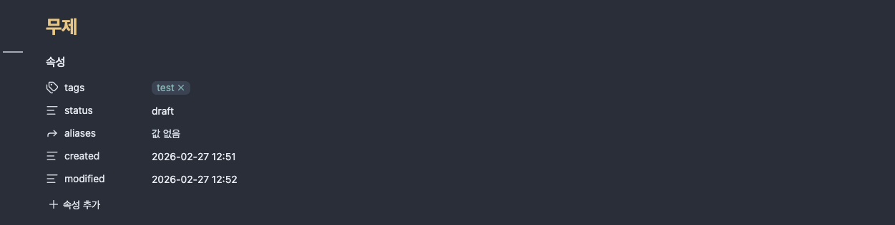
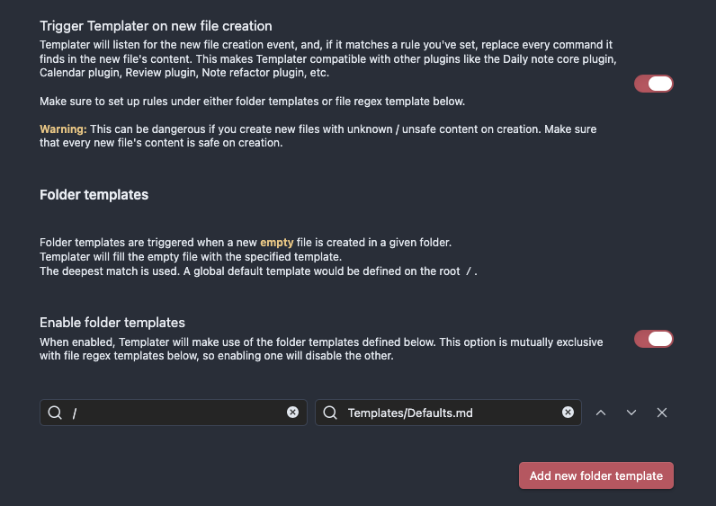
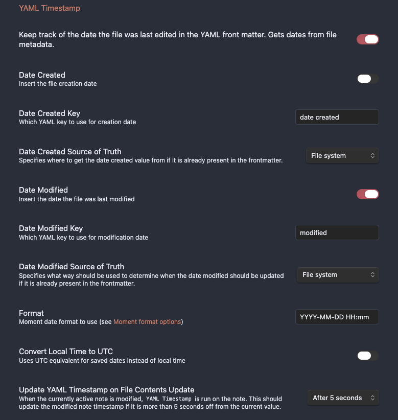

---
tags:
  - obsidian
  - setting
status: draft
aliases: []
created: 2026-02-27 12:53
modified: 2026-03-11 10:35
---


위 4개의 속성은 templater 플러그인, 아래 modified 는 linter 플러그인 사용.
templater 플러그인 다운로드, 활성화 한 후에 세팅.

모든 폴더에 적용하게 하고, 어떤 파일을 기본값으로 할지 정의해야 한다. 
Defaults.md
```

---
created: <% tp.date.now("YYYY-MM-DD HH:mm") %>
tags: []
status: draft
aliases: []

---

# <% tp.file.title %>

```

이렇게 정의하면 노트를 생성할 때마다 기본 속성이 추가된다. (명석님 세팅에서는 obsidian-nvim.lua 를 수정해줘야 한다.)
노트가 변경될때마다 수정하고 싶다면 linter 플러그인을 사용하자. 

linter 설치 후 설정 하는 곳에 가면 yaml 설정이 있다.
yaml timstamp 활성화 시키고 세팅해주면 된다. 단 date created 는 지정하면 template 과 겹칠 수 있으니 사용하지 말자.



linter 를 적용하고 command + p 를 눌러 팔레트를 열고, Linter: lint all files in the vault 를 실행하면 기존 vault 의 모든 파일에 modified 속성이 추가된다.
만약 잘못 추가했다면 괜히 복잡해지니 신중히 확인 후 실행하자.

지울때는 obsidian 에서 스크립트 실행하는 방식, vscode 활용하는 방식등 여러가지 방식이 나오는데 그냥 터미널에서 명령어로 지우는게 제일 편하고 빨랐다.
단, 삭제하려는 속성이 특정 문서에서는 이미 잘 사용하고 있던 값은 아닌지 확인후에 실행해야 한다.


